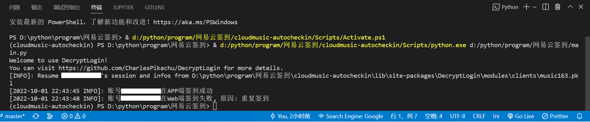
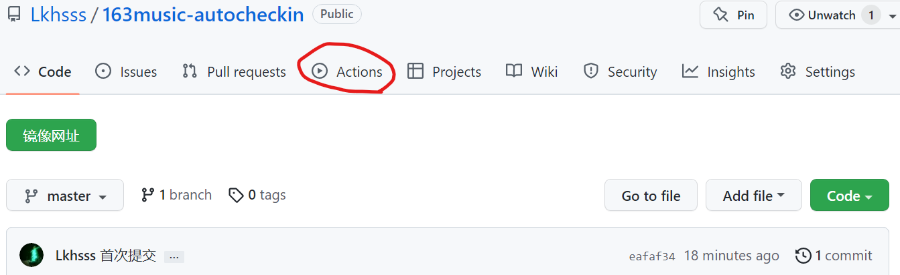
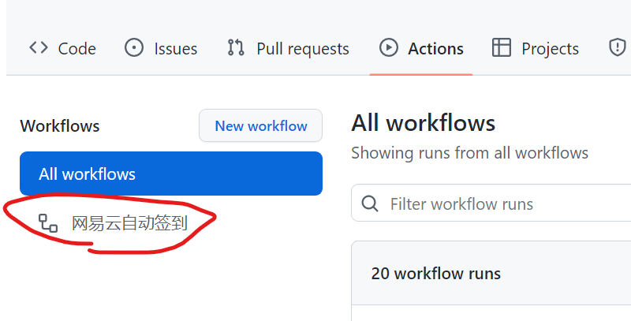
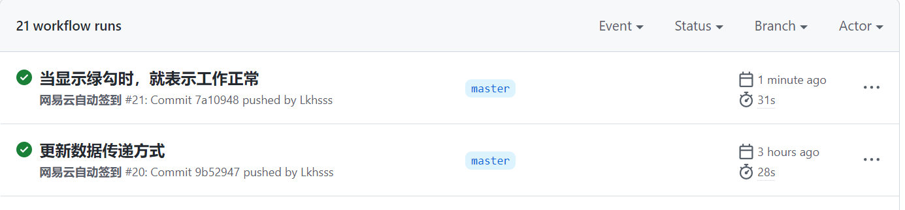

## 一个简单的，基于 Github Action 的网易云自动签到脚本

> 为了需要把[Charles 的皮卡丘](https://mp.weixin.qq.com/s/8d7smUSzW2ds1ypZq-yeFw)的代码改了一下，做了个可以用 github action 的网易云签到脚本。配置好后可以一直不用管。不用自备服务器，没有其他花里胡哨功能。

> 本人学术不精，同时也暂时没有时间改良登录配置，将就一下吧

---

### Github Actions 部署指南

运行环境：windows 11
python: 3.9.5
运行库：DecryptLogin

---

#### 一、克隆此项目到本地

1.可以点击**下载**按钮下载 zip 包

2.也可以复制此代码到 cmd 运行 ↓
`git clone https://github.com/Lkhsss/163music-autocheckin.git`

---

#### 二、配置配置文件

在`config.ini`文件中配置自己的设置

`username`为你的网易云账号电话号码

`logintype`为登录方式（`pc`、`scanqr`可选，一个是验证码登录，一个是扫描二维码登录）

---

#### 三、获得`music163.pkl`文件

克隆到本地后，导航到此文件夹，使用`pip install -r requirements.txt`安装运行库

然后运行`getcookie.py`文件，如果运行不成功，多半是运行环境没有配好（重新配置 python，安装运行库：DecryptLogin 库），或者有多个 python 环境（手动 copy，运行 getcookie.py 有提示路径）

---

#### 四、上传仓库

再运行一遍`main.py`，确认没有运行错误或其他提示

然后上传到任意仓库

---

#### 五、运行

在仓库首页点击`Acions`

再点击 **I understand my workflows, go ahead and enable them**

点击“网易云自动签到”即可查看详情

如图，左边显示绿勾时，就表示工作流工作正常

---

#### 六、注意事项

1. 该工作流每天自动运行两次，在上午 6 点和晚上 22 点。
    > 可以通过修改`autocheckin.yml`来更改时间和次数

2. 可以通过点击 ***Star*** 手动运行。

---

### 感谢[Ysnsn 的项目提供灵感](https://github.com/Ysnsn/wangyiyun-action)

> （但是他的项目不能用了，额而且好像有很多这个项目副本，不知道谁是原作者）

### 感谢[DecryptLogin 的实战案例](https://httpsgithubcomcharlespikachudecryptlogin.readthedocs.io/zh/latest/EXAMPLES.html)

###感谢[Charles 的皮卡丘](https://mp.weixin.qq.com/s/8d7smUSzW2ds1ypZq-yeFw)提供的原脚本
